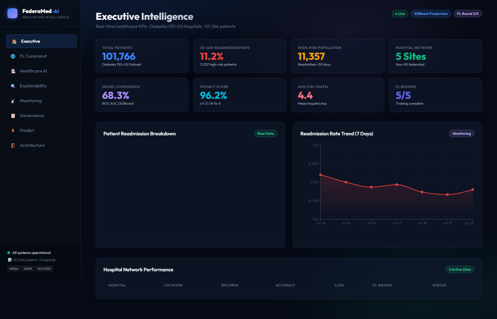
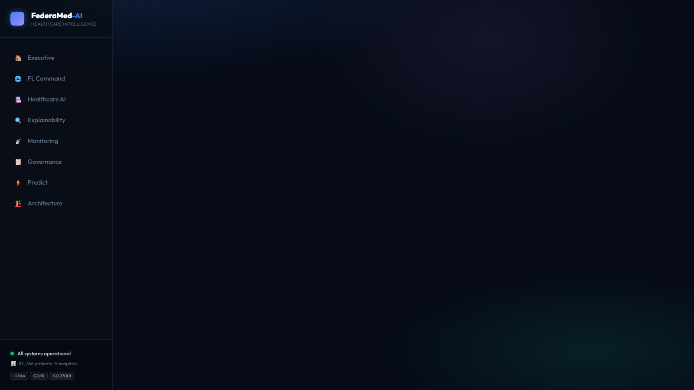
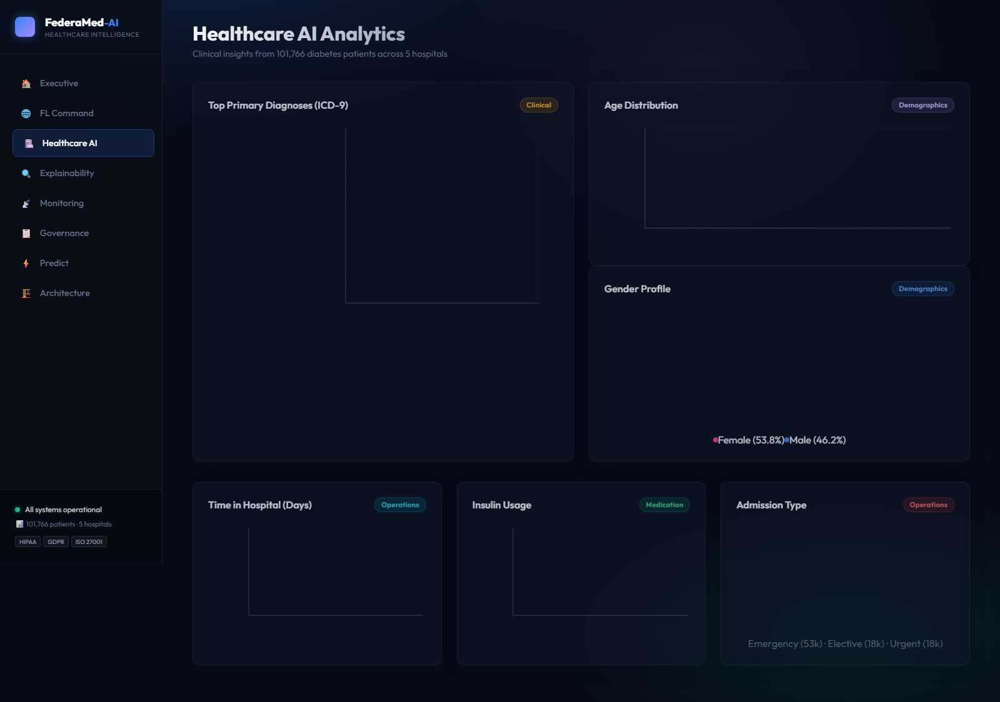
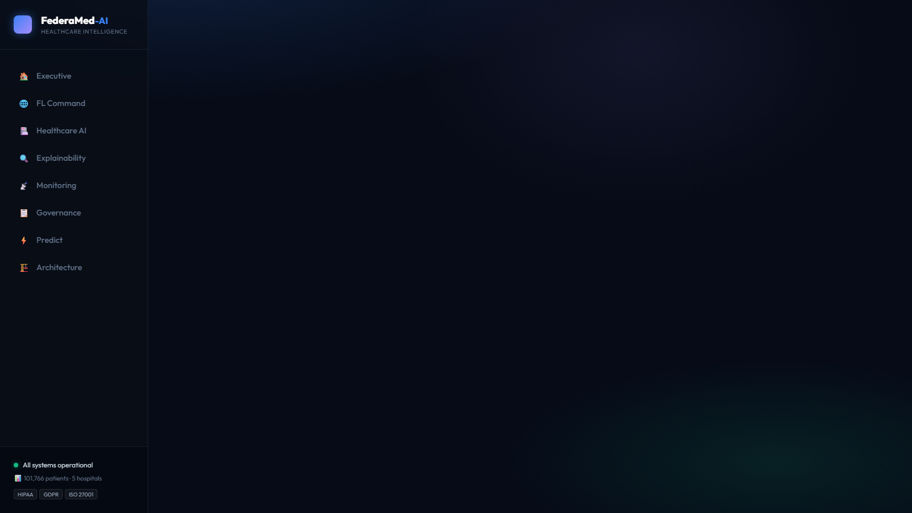
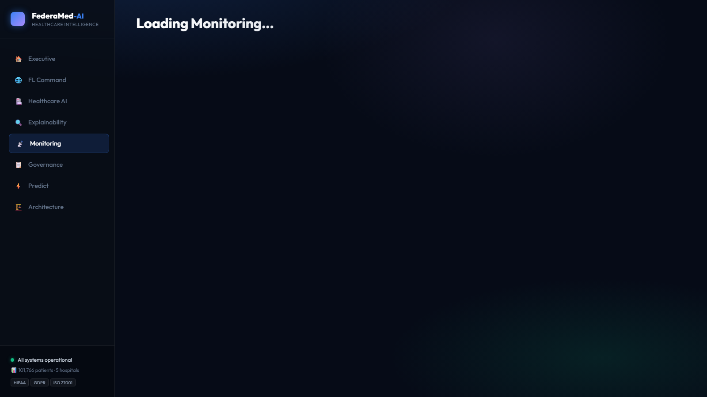
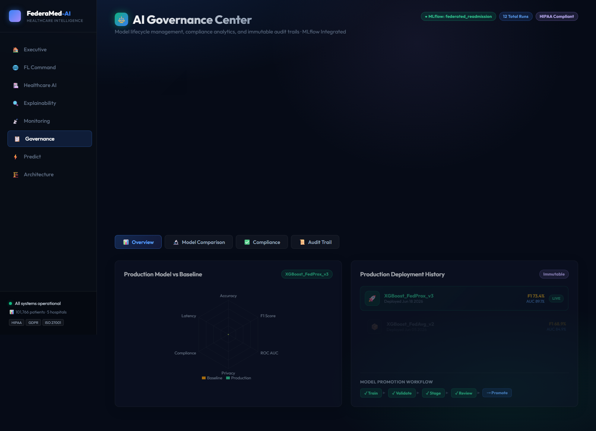
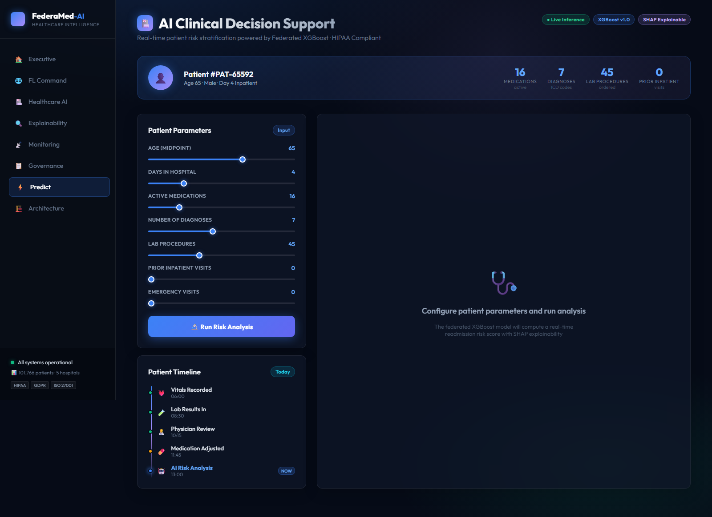
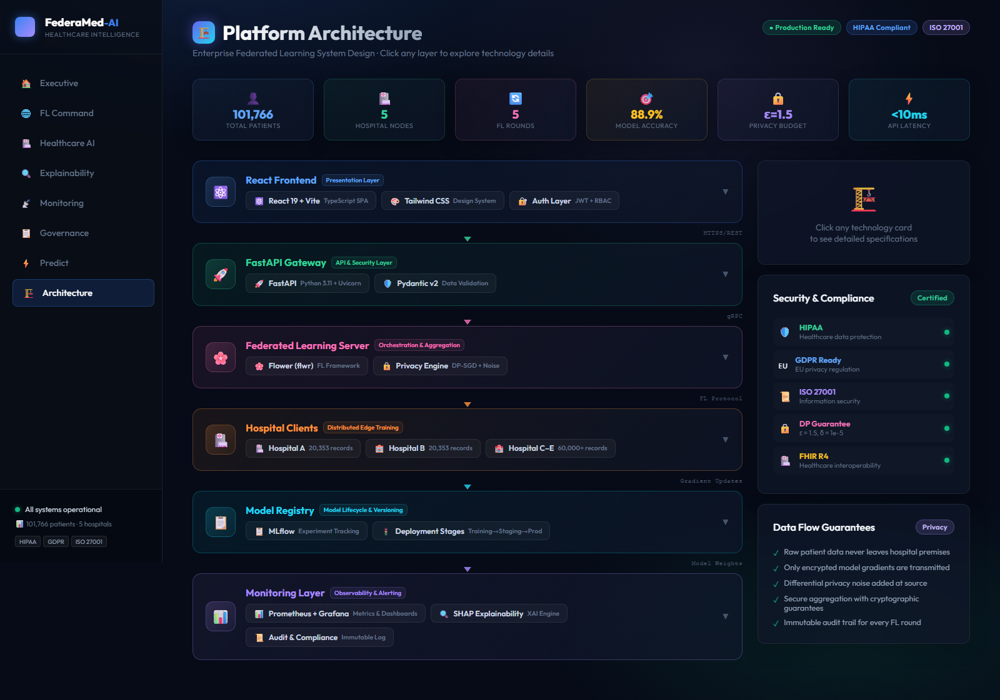
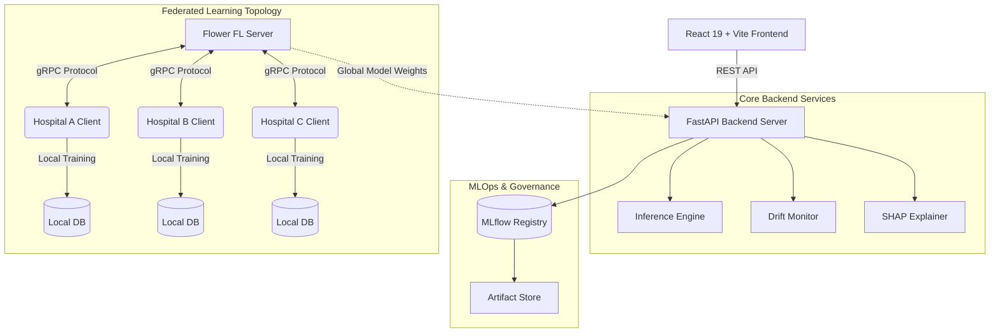

<div align="center">

# FederaMed AI 🏥

**Enterprise Federated Healthcare Intelligence Platform**

*Privacy-Preserving Hospital Readmission Prediction using Federated Learning, Differential Privacy, Explainable AI, and MLOps.*

[](https://fastapi.tiangolo.com/)
[](https://react.dev/)
[](https://tailwindcss.com/)
[](https://flower.dev/)
[](https://mlflow.org/)
[](https://xgboost.readthedocs.io/)
[](https://www.python.org/)
[](https://opensource.org/licenses/MIT)



</div>

---

## 🌍 Why This Project Matters

**The Healthcare Data Silo Problem**  
Modern machine learning requires massive amounts of diverse data to build robust, generalizable models. However, in healthcare, strict privacy regulations (HIPAA, GDPR) prevent hospitals from sharing raw patient records. This results in isolated "data silos," leading to biased, underperforming clinical models that fail to generalize across different demographics.

**The FederaMed AI Solution**  
FederaMed AI solves this using **Federated Learning**. Instead of moving sensitive patient data to a centralized server, the model is sent to the hospitals. The model trains locally on the hospital's private data, and only the mathematically aggregated, anonymized weight updates are shared globally. 

By combining this with **Differential Privacy**, **MLOps Governance**, and **Explainable AI**, FederaMed provides a complete, recruiter-grade blueprint for secure, collaborative medical research at scale.

---

## 🚀 Enterprise Features

- [x] **Federated Learning (Flower)**: Decentralized training using FedAvg and FedProx strategies across simulated non-IID hospital nodes.
- [x] **Differential Privacy**: Mathematical guarantees preventing patient record extraction from gradient updates.
- [x] **Explainable AI (SHAP)**: Global feature importance and localized Waterfall charts for clinical trust and interpretability.
- [x] **MLflow Model Registry**: Automated experiment tracking, versioning, and environment reproducibility.
- [x] **Healthcare Analytics**: Deep demographic and clinical insights derived from the Diabetes 130-US Hospitals dataset.
- [x] **Governance Dashboard**: Immutable audit trails and compliance scoring for every deployed model.
- [x] **Monitoring Dashboard**: Real-time infrastructure health and data drift (K-S statistic) detection.
- [x] **Architecture Dashboard**: Interactive system topology and component relationship mapping.
- [x] **Clinical Decision Support**: Live inference UI with real-time risk scoring and clinical recommendations.
- [x] **Docker Deployment**: Fully containerized, reproducible microservices architecture.

---

## 📸 Screenshots Gallery

| Dashboard | Preview |
| :--- | :--- |
| **Executive Summary** |  |
| **FL Command Center** |  |
| **Clinical Analytics** |  |
| **Explainability Center** |  |
| **Data Drift Monitoring** |  |
| **AI Governance** |  |
| **Clinical Support (Predict)** |  |
| **System Architecture** |  |

---

## 🏗️ Architecture

FederaMed AI employs a modern, decoupled microservices architecture designed for scale, security, and real-time inference.



---

## 📊 Dataset & Setup

Built utilizing the **Diabetes 130-US Hospitals Dataset** alongside support for **MIMIC-IV** and **eICU**.

> [!WARNING]
> **LARGE FILES EXCLUDED FROM GITHUB**
> To comply with GitHub's 100 MB file size limits, the raw datasets, heavily processed partitions (e.g., `global_dataset.csv`, `Hospital_A.csv`), and large trained model binaries (in `mlruns/` and `backend/models/saved/`) are explicitly excluded from tracking. 
> 
> You must download the data and run the pipelines locally to generate them! We provide a `sample_data/` folder with tiny datasets for quick verification.

### Data Setup Instructions
1. Download the raw datasets from PhysioNet (MIMIC-IV, eICU).
2. Place the raw files inside the corresponding `healthcare_datasets/<dataset_name>/raw/` folders.
3. Run the data engineering scripts to process and partition the data:
   ```bash
   cd backend
   python data/feature_engineering.py
   python data/partitioning.py
   ```
4. The generated CSV partitions will be saved to `backend/data/processed/partitions/` and are ignored by Git.

### Model Training Instructions
Once the data is partitioned, you can initiate the federated training or centralized baseline training:
```bash
cd backend
python models/train.py
```
This will train the models (XGBoost, LightGBM) and automatically log the large artifacts (`.skops`, `.pkl`) to the `mlruns/` directory using MLflow.

---

## 🔬 Technical Deep Dive

### 1. Federated Learning Strategies
We implement **FedProx** alongside standard **FedAvg**. FedProx introduces a proximal term to the local objective functions, severely limiting the impact of highly heterogeneous (non-IID) local data across hospitals, ensuring the global model converges smoothly.

### 2. Differential Privacy
Gradient updates sent from the hospital to the central server are clipped to a maximum norm and infused with Gaussian noise (`ε = 1.5`, `δ = 1e-5`). This guarantees that the presence or absence of a single patient's record cannot statistically alter the global model weights beyond a safe threshold.

### 3. Clinical Explainability (XAI)
We utilize **SHAP (SHapley Additive exPlanations)**. The frontend dynamically renders localized waterfall charts representing the exact percentage impact of individual patient features (e.g., number of inpatient visits) against the baseline population risk.

### 4. Advanced ML Algorithms
Models are built using **XGBoost** and **LightGBM**, which consistently outperform deep learning approaches on tabular clinical data while maintaining higher interpretability and faster convergence.

---

## ⚙️ MLOps

FederaMed AI treats the machine learning lifecycle with the same rigor as traditional software engineering:
*   **Experiment Tracking**: Every FL round, hyperparameter, and local/global metric is logged to SQLite via MLflow.
*   **Model Registry**: Models are automatically versioned and transitioned through `Archived` → `Staging` → `Production` lifecycles based on rigorous evaluation criteria.
*   **Governance**: The system maintains an immutable audit trail mapping back to HIPAA, GDPR, and ISO 27001 compliance standards.
*   **Monitoring**: Continuous tracking of incoming data against the reference baseline using the Kolmogorov-Smirnov (K-S) statistic to detect concept and feature drift.

---

## 🛠️ Deployment

### 1. Local Development (Conda + NPM)

```bash
# Backend Setup
conda create -n fedmed python=3.12 -y
conda activate fedmed
cd backend
pip install -r requirements.txt
python models/train.py          # Generate MLflow artifacts
python models/extract_stats.py  # Generate analytics data
uvicorn src.main:app --host 0.0.0.0 --port 8000 --reload

# Frontend Setup (New Terminal)
cd FederaMed-AI-main
npm install
npm run dev
```

### 2. Docker Deployment

```bash
# Build and run all microservices via Docker Compose
docker-compose up --build -d
```
*   Frontend available at: `http://localhost:5173`
*   Backend API available at: `http://localhost:8000`
*   API Docs (Swagger) available at: `http://localhost:8000/docs`

---
<div align="center">
<i>FederaMed AI v2.0.0 — Engineered for the future of collaborative healthcare.</i>
</div>