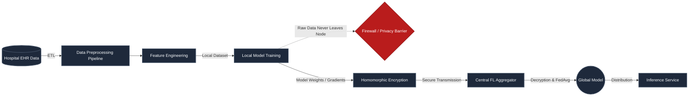

# Data Flow Architecture

```mermaid
flowchart LR
    classDef default fill:#1e293b,stroke:#475569,stroke-width:2px,color:#f8fafc;
    classDef secure fill:#b91c1c,stroke:#991b1b,stroke-width:2px,color:#ffffff;
    classDef process fill:#0ea5e9,stroke:#0284c7,stroke-width:2px,color:#ffffff;

    EHR[(Hospital EHR Data)] --> |ETL| Preprocess[Data Preprocessing Pipeline]
    Preprocess --> FeatureEng[Feature Engineering]
    FeatureEng --> |Local Dataset| LocalTraining[Local Model Training]
    
    LocalTraining -.-> |Raw Data Never Leaves Node| Firewall{Firewall / Privacy Barrier}
    class Firewall secure;

    LocalTraining --> |Model Weights / Gradients| Encryption[Homomorphic Encryption]
    Encryption --> |Secure Transmission| CentralAggregator[Central FL Aggregator]
    
    CentralAggregator --> |Decryption & FedAvg| GlobalModel((Global Model))
    GlobalModel --> |Distribution| InferenceService[Inference Service]
```
