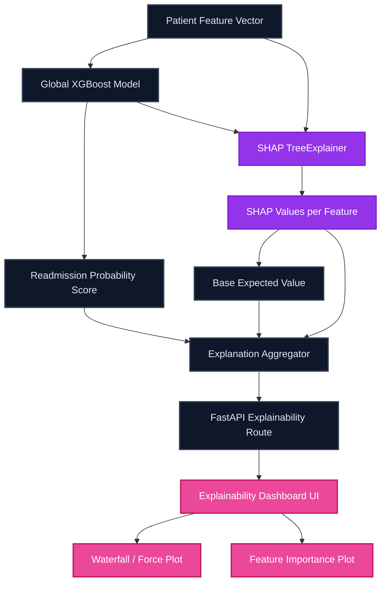

# Explainability Workflow

```mermaid
graph TD
    classDef default fill:#0f172a,stroke:#334155,stroke-width:2px,color:#e2e8f0;
    classDef shap fill:#9333ea,stroke:#7e22ce,stroke-width:2px,color:#ffffff;
    classDef ui fill:#ec4899,stroke:#be185d,stroke-width:2px,color:#ffffff;

    Input[Patient Feature Vector] --> Model[Global XGBoost Model]
    Model --> Pred[Readmission Probability Score]
    
    Input --> ShapEngine[SHAP TreeExplainer]
    Model --> ShapEngine
    
    ShapEngine --> ShapVals[SHAP Values per Feature]
    ShapVals --> BaseValue[Base Expected Value]
    
    Pred --> Combine[Explanation Aggregator]
    ShapVals --> Combine
    BaseValue --> Combine
    
    Combine --> API[FastAPI Explainability Route]
    API --> Dashboard[Explainability Dashboard UI]
    
    Dashboard --> ForcePlot[Waterfall / Force Plot]
    Dashboard --> SummaryPlot[Feature Importance Plot]
    
    class ShapEngine,ShapVals shap;
    class Dashboard,ForcePlot,SummaryPlot ui;
```
