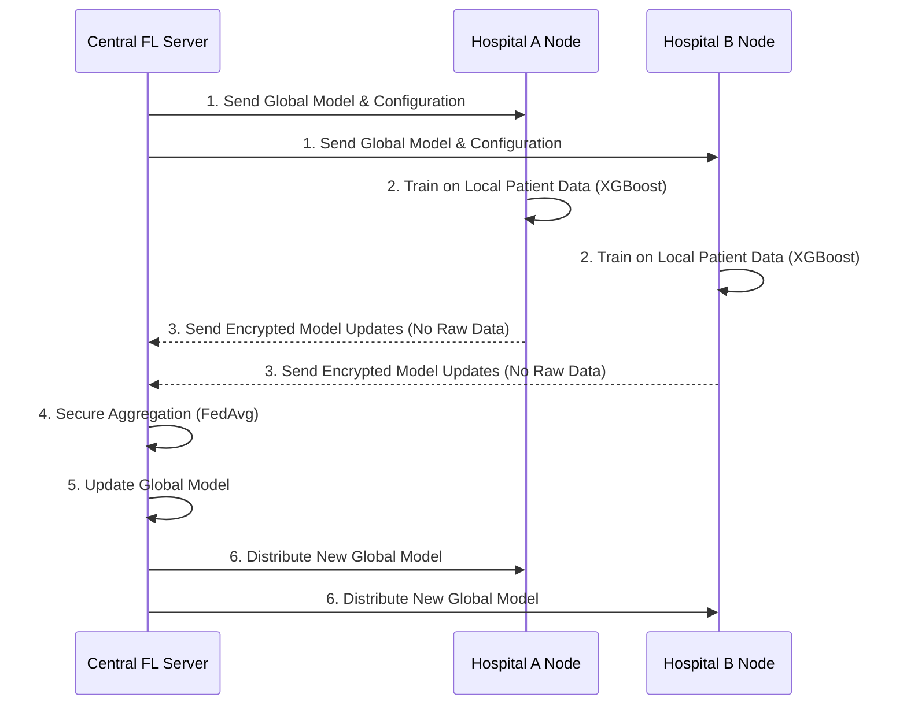

# Federated Learning Architecture

```mermaid
sequenceDiagram
    participant FLServer as Central FL Server
    participant Node1 as Hospital A Node
    participant Node2 as Hospital B Node
    
    FLServer->>Node1: 1. Send Global Model & Configuration
    FLServer->>Node2: 1. Send Global Model & Configuration
    
    Node1->>Node1: 2. Train on Local Patient Data (XGBoost)
    Node2->>Node2: 2. Train on Local Patient Data (XGBoost)
    
    Node1-->>FLServer: 3. Send Encrypted Model Updates (No Raw Data)
    Node2-->>FLServer: 3. Send Encrypted Model Updates (No Raw Data)
    
    FLServer->>FLServer: 4. Secure Aggregation (FedAvg)
    FLServer->>FLServer: 5. Update Global Model
    
    FLServer->>Node1: 6. Distribute New Global Model
    FLServer->>Node2: 6. Distribute New Global Model
```
