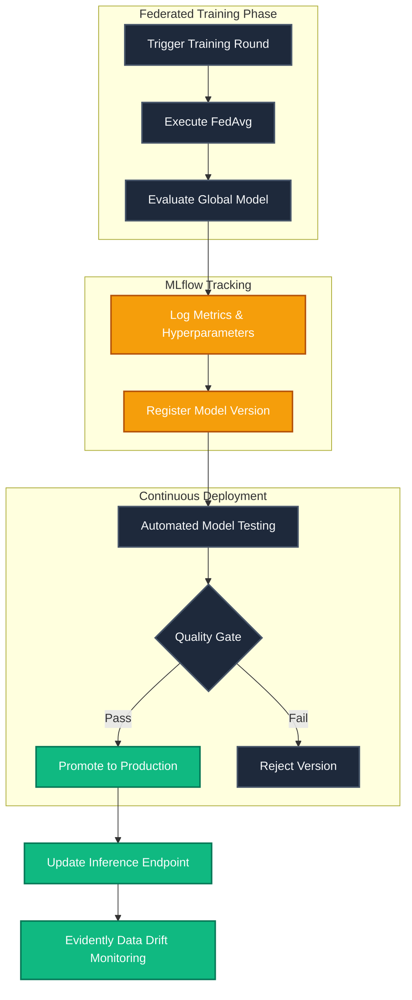

# MLOps Pipeline

```mermaid
graph TD
    classDef default fill:#1e293b,stroke:#475569,stroke-width:2px,color:#f8fafc;
    classDef mlflow fill:#f59e0b,stroke:#b45309,stroke-width:2px,color:#ffffff;
    classDef deploy fill:#10b981,stroke:#047857,stroke-width:2px,color:#ffffff;

    subgraph Training [Federated Training Phase]
        Train[Trigger Training Round] --> Run[Execute FedAvg]
        Run --> Eval[Evaluate Global Model]
    end

    subgraph Tracking [MLflow Tracking]
        Eval --> LogMetrics[Log Metrics & Hyperparameters]
        LogMetrics --> Register[Register Model Version]
    end

    subgraph CI_CD [Continuous Deployment]
        Register --> Test[Automated Model Testing]
        Test --> Approve{Quality Gate}
        Approve -->|Pass| Promote[Promote to Production]
        Approve -->|Fail| Reject[Reject Version]
    end

    Promote --> Endpoint[Update Inference Endpoint]
    Endpoint --> Monitor[Evidently Data Drift Monitoring]

    class LogMetrics,Register mlflow;
    class Promote,Endpoint,Monitor deploy;
```
