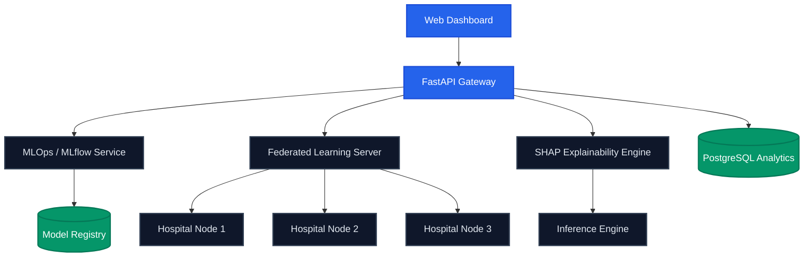

# System Architecture

```mermaid
graph TD
    classDef default fill:#0f172a,stroke:#334155,stroke-width:2px,color:#e2e8f0;
    classDef highlight fill:#2563eb,stroke:#1d4ed8,stroke-width:2px,color:#ffffff;
    classDef db fill:#059669,stroke:#047857,stroke-width:2px,color:#ffffff;

    User[Web Dashboard] --> API[FastAPI Gateway]
    API --> ML[MLOps / MLflow Service]
    API --> FL[Federated Learning Server]
    API --> Explain[SHAP Explainability Engine]
    API --> DB[(PostgreSQL Analytics)]

    FL --> Node1[Hospital Node 1]
    FL --> Node2[Hospital Node 2]
    FL --> Node3[Hospital Node 3]

    ML --> ModelRegistry[(Model Registry)]
    Explain --> Prediction[Inference Engine]

    class User,API highlight;
    class DB,ModelRegistry db;
```
