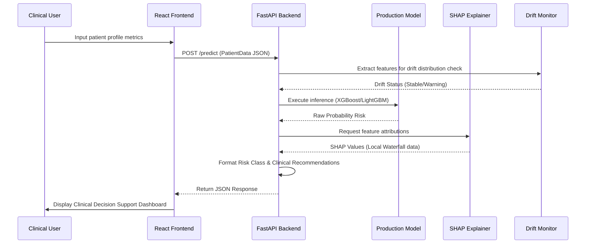

# Prediction Data Flow Diagram

```mermaid
sequenceDiagram
    participant User as Clinical User
    participant UI as React Frontend
    participant API as FastAPI Backend
    participant Model as Production Model
    participant XAI as SHAP Explainer
    participant Mon as Drift Monitor

    User->>UI: Input patient profile metrics
    UI->>API: POST /predict (PatientData JSON)
    
    API->>Mon: Extract features for drift distribution check
    Mon-->>API: Drift Status (Stable/Warning)
    
    API->>Model: Execute inference (XGBoost/LightGBM)
    Model-->>API: Raw Probability Risk
    
    API->>XAI: Request feature attributions
    XAI-->>API: SHAP Values (Local Waterfall data)
    
    API->>API: Format Risk Class & Clinical Recommendations
    API-->>UI: Return JSON Response
    
    UI->>User: Display Clinical Decision Support Dashboard
```
