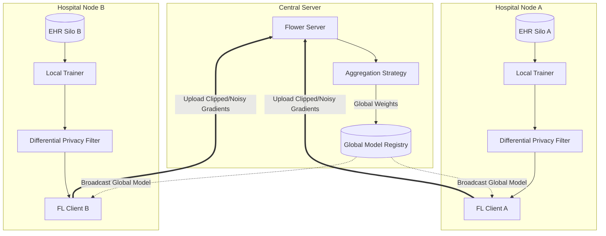

# Federated Learning Topology

```mermaid
graph TD
    subgraph Central Server
        FL[Flower Server]
        Agg[Aggregation Strategy]
        FL --> Agg
        Agg -->|Global Weights| Reg[(Global Model Registry)]
    end

    subgraph Hospital Node A
        ClientA[FL Client A]
        DataA[(EHR Silo A)]
        TrainA[Local Trainer]
        DP_A[Differential Privacy Filter]
        
        DataA --> TrainA
        TrainA --> DP_A
        DP_A --> ClientA
    end

    subgraph Hospital Node B
        ClientB[FL Client B]
        DataB[(EHR Silo B)]
        TrainB[Local Trainer]
        DP_B[Differential Privacy Filter]
        
        DataB --> TrainB
        TrainB --> DP_B
        DP_B --> ClientB
    end

    %% Network interactions
    Reg -.->|Broadcast Global Model| ClientA
    Reg -.->|Broadcast Global Model| ClientB
    
    ClientA ==>|Upload Clipped/Noisy Gradients| FL
    ClientB ==>|Upload Clipped/Noisy Gradients| FL
```
