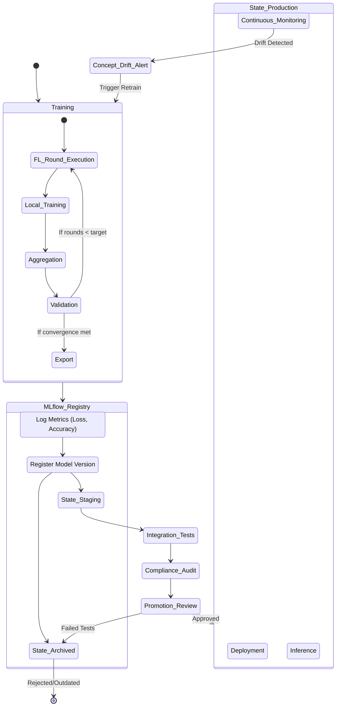

# Model Governance Workflow

```mermaid
stateDiagram-v2
    [*] --> Training
    
    state Training {
        [*] --> FL_Round_Execution
        FL_Round_Execution --> Local_Training
        Local_Training --> Aggregation
        Aggregation --> Validation
        Validation --> FL_Round_Execution: If rounds < target
        Validation --> Export: If convergence met
    }
    
    Training --> MLflow_Registry
    
    state MLflow_Registry {
        state "Log Metrics (Loss, Accuracy)" as Log
        state "Register Model Version" as Reg
        Log --> Reg
        Reg --> State_Archived
        Reg --> State_Staging
    }
    
    State_Archived --> [*]: Rejected/Outdated
    
    State_Staging --> Integration_Tests
    Integration_Tests --> Compliance_Audit
    Compliance_Audit --> Promotion_Review
    
    Promotion_Review --> State_Production: Approved
    Promotion_Review --> State_Archived: Failed Tests
    
    state State_Production {
        Deployment
        Inference
        Continuous_Monitoring
    }
    
    Continuous_Monitoring --> Concept_Drift_Alert: Drift Detected
    Concept_Drift_Alert --> Training: Trigger Retrain
```
