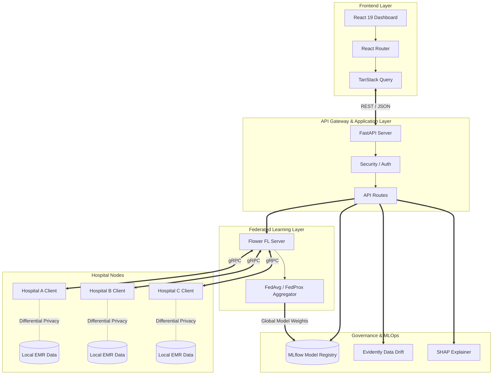

# System Architecture Diagram

```mermaid
graph TD
    subgraph Client [Frontend Layer]
        UI[React 19 Dashboard]
        Router[React Router]
        State[TanStack Query]
        UI --> Router
        Router --> State
    end

    subgraph Gateway [API Gateway & Application Layer]
        FastAPI[FastAPI Server]
        Auth[Security / Auth]
        Routes[API Routes]
        FastAPI --> Auth
        Auth --> Routes
    end

    subgraph FL [Federated Learning Layer]
        FLServer[Flower FL Server]
        Aggregator[FedAvg / FedProx Aggregator]
        FLServer --> Aggregator
    end

    subgraph Hospitals [Hospital Nodes]
        HospA[Hospital A Client]
        HospB[Hospital B Client]
        HospC[Hospital C Client]
        HospA -.-|Differential Privacy| LocalDataA[(Local EMR Data)]
        HospB -.-|Differential Privacy| LocalDataB[(Local EMR Data)]
        HospC -.-|Differential Privacy| LocalDataC[(Local EMR Data)]
    end

    subgraph MLOps [Governance & MLOps]
        MLflow[(MLflow Model Registry)]
        Monitoring[Evidently Data Drift]
        XAI[SHAP Explainer]
    end

    %% Connections
    State <==>|REST / JSON| FastAPI
    Routes ==> FLServer
    Routes ==> Monitoring
    Routes ==> XAI
    Routes ==> MLflow

    FLServer <==>|gRPC| HospA
    FLServer <==>|gRPC| HospB
    FLServer <==>|gRPC| HospC

    Aggregator ==>|Global Model Weights| MLflow
```
