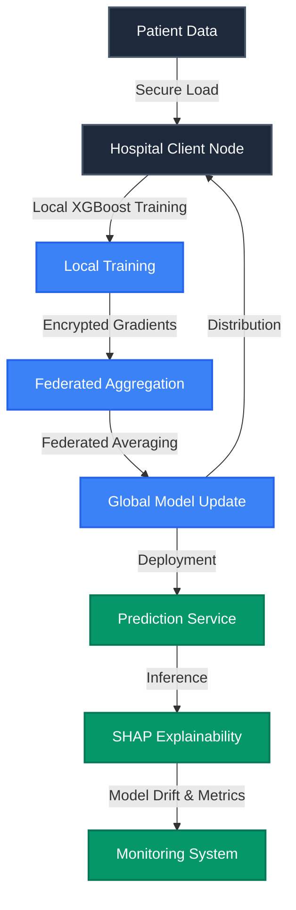

# End-to-End Workflow

```mermaid
graph TD
    classDef default fill:#1e293b,stroke:#475569,stroke-width:2px,color:#f8fafc;
    classDef highlight fill:#3b82f6,stroke:#2563eb,stroke-width:2px,color:#ffffff;
    classDef action fill:#059669,stroke:#047857,stroke-width:2px,color:#ffffff;

    A[Patient Data] -->|Secure Load| B[Hospital Client Node]
    B -->|Local XGBoost Training| C[Local Training]
    C -->|Encrypted Gradients| D[Federated Aggregation]
    D -->|Federated Averaging| E[Global Model Update]
    E -->|Distribution| B
    E -->|Deployment| F[Prediction Service]
    F -->|Inference| G[SHAP Explainability]
    G -->|Model Drift & Metrics| H[Monitoring System]

    class A,B default;
    class C,D,E highlight;
    class F,G,H action;
```
